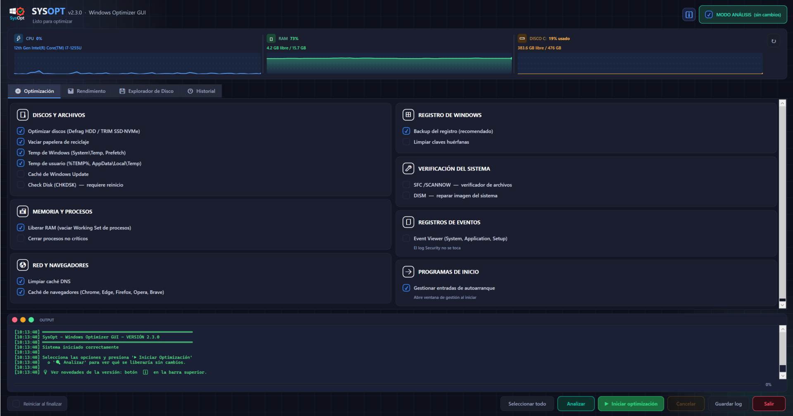
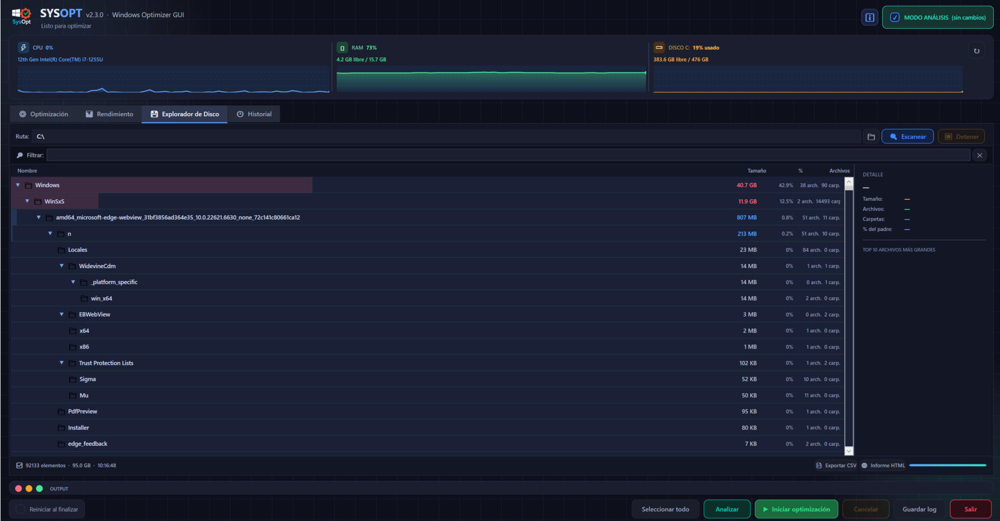
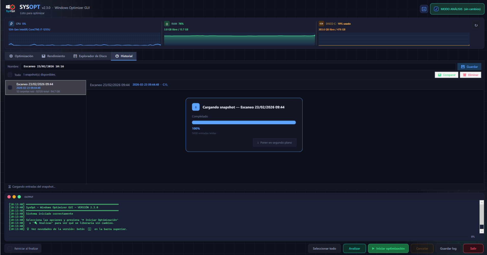
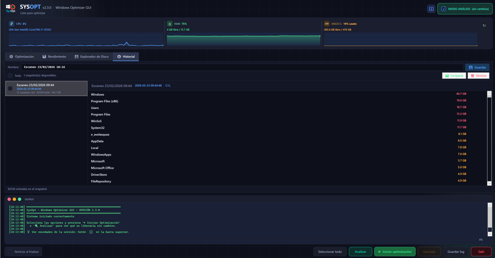
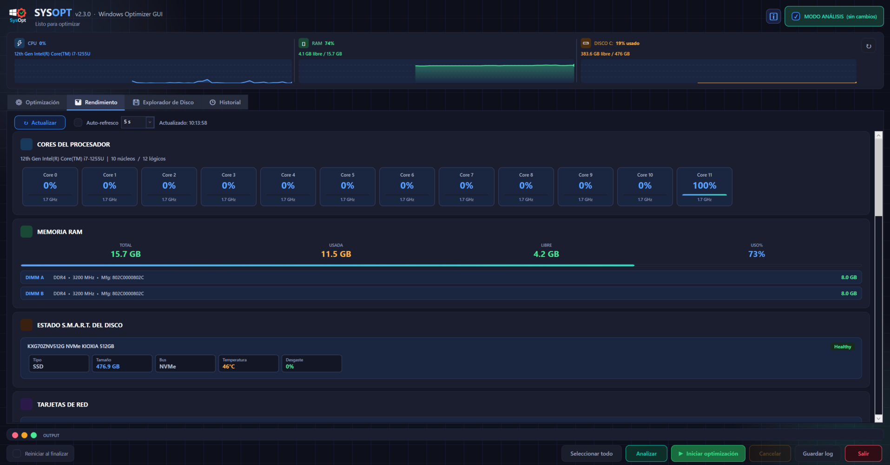
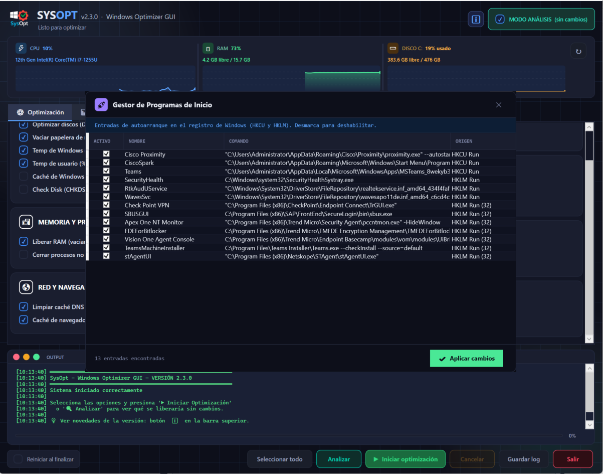

#  SysOpt v2.3.0 — Windows System Optimizer (Español)
**Script PowerShell con interfaz gráfica — `SysOpt.ps1`**

> **Nota de versión:** La versión pública estable es **v2.3.0**. La rama de desarrollo interno activa es **v2.4.0**, que incluye las optimizaciones FIFO de RAM y correcciones de estabilidad adicionales, aún no publicada como release estable.

Este proyecto implementa un **optimizador avanzado para Windows**, desarrollado íntegramente en **PowerShell** y utilizando una interfaz gráfica basada en **WPF/XAML**. Permite ejecutar tareas de mantenimiento, limpieza, verificación y optimización del sistema desde una única ventana, con monitorización de recursos en tiempo real, barra de progreso, consola integrada y modo de análisis sin cambios.

---

## 📸 Vista previa de la interfaz



---

## 🚀 Funcionalidades principales

### 🗄️ Discos y Archivos
- Optimización automática según tipo de disco:
  - **SSD → TRIM**
  - **HDD → Desfragmentación**
- Vaciar papelera de reciclaje en todas las unidades
- Eliminar archivos temporales de Windows (`System\Temp`, `Prefetch`)
- Eliminar archivos temporales del usuario (`%TEMP%`, `AppData\Local\Temp`)
- Limpiar caché de **Windows Update** (`SoftwareDistribution\Download`)
- Programar **CHKDSK /F /R** para el próximo reinicio

### 🔍 Explorador de Disco

Escáner de carpetas estilo **TreeSize**: analiza de forma recursiva y paralela cualquier unidad o directorio y muestra el uso real de disco por carpeta con barras visuales proporcionales, permitiendo identificar de un vistazo qué ocupa más espacio.



- Escaneo recursivo paralelo con **ParallelScanner** (C# inline)
- Árbol de carpetas con tamaños, porcentajes y barras visuales proporcionales
- **Colapsar y expandir carpetas** sin bloqueo de UI (childMap cacheado, DFS con frame stack)
- **Filtro en tiempo real** por nombre de carpeta
- **Menú contextual** oscuro temático: abrir, copiar ruta, escanear subcarpeta, eliminar
- **Exportar a CSV** con `StreamWriter` directo (sin materializar el CSV en RAM)
- **Exportar a HTML** con informe visual completo (async, con barra de progreso) — genera un documento navegable con la jerarquía de carpetas, tamaños y colores codificados por uso
- **Explorador de archivos** por carpeta — escaneo streaming con `ConcurrentQueue`, filtro, ordenación y eliminación directa
- Memoria adaptativa según RAM libre (BATCH + intervalo de timer ajustados automáticamente)

### 📸 Historial de Escaneos (Snapshots)

La ventana de snapshots permite **guardar y cargar el estado completo de cualquier escaneo** como archivo JSON. Al abrir la lista de snapshots se muestran solo los metadatos (nombre, fecha, número de carpetas y tamaño total) sin cargar los entries en RAM — la carga de datos se produce únicamente al seleccionar un snapshot concreto.




- **Guardar** el estado del escaneo actual como snapshot JSON con nombre personalizable
- **Lista de snapshots** cargada en background sin bloquear la UI (solo metadatos vía streaming)
- **Cargar snapshot**: restaura la vista del explorador con los datos guardados
- **Comparar escaneos**: detecta carpetas nuevas, eliminadas y cambios de tamaño entre dos estados del sistema — soporta tres modos:
  - Snapshot vs escaneo actual cargado
  - Snapshot A vs Snapshot B (comparación histórica entre dos fechas)
- Selección múltiple con checkboxes, botón "Todo" para marcar/desmarcar en lote
- Eliminación en lote con confirmación
- Comparador O(1) con `HashSet<string>` + `Dictionary<string,long>` (sin iteraciones cuadráticas)

### 📊 Pestaña Rendimiento

Monitorización en tiempo real del sistema al estilo Task Manager, con gráficas actualizadas automáticamente.



- **CPU**: porcentaje de uso con gráfica histórica
- **RAM**: uso actual y disponible en tiempo real
- **Disco**: actividad de lectura/escritura
- **Red**: velocidad de subida y bajada en tiempo real, con detección de tipo de interfaz (Ethernet 🔌 / WiFi 📶)
- **SMART del disco**: estado de salud del disco principal
- **Auto-refresco configurable**: intervalos de 5, 15, 30 y 60 segundos

### 💾 Memoria y Procesos
- Liberar RAM real mediante **EmptyWorkingSet** (Win32 API nativa)
- Cerrar procesos no críticos (opcional)

### 🌐 Red y Navegadores
- Limpiar caché DNS
- Limpiar caché de navegadores: **Chrome, Firefox (cache + cache2), Edge, Opera, Opera GX, Brave**

### 📋 Registro de Windows
- Crear copia de seguridad del registro (requerida antes de limpiar)
- Buscar y limpiar claves huérfanas

### 🔧 Verificación del Sistema
- Ejecutar **SFC /SCANNOW**
- Ejecutar **DISM /RestoreHealth**

### 📋 Registros de Eventos
- Limpiar logs de **Event Viewer**: System, Application, Setup
- El log de Seguridad no se modifica

### 🔍 Modo Análisis (Dry Run)
Ejecuta un análisis completo del sistema **sin realizar ningún cambio**. Genera un informe de diagnóstico con puntuación de salud del sistema, detectando problemas críticos y avisos.


> *Informe de Diagnóstico con puntuación del sistema, detalle por categorías y opción de exportar.*

### 🚀 Gestión de Programas de Inicio
Ventana dedicada para **ver y gestionar las entradas de autoarranque** de Windows (HKCU Run y HKLM Run). Permite activar o desactivar programas de inicio sin necesidad de herramientas externas.



### 📟 Consola integrada
- Registro detallado de cada acción con timestamps automáticos
- Indicador de progreso con porcentaje exacto y tarea actual
- Aviso antes de limpiar la consola si contiene contenido

---

## 🖥️ Interfaz gráfica (GUI)

Construida en XAML, incluye:

- **Panel de recursos en tiempo real** — gráficas de CPU, RAM y Disco tipo Task Manager
- Estilos personalizados para botones, checkboxes y grupos con colores distintivos por sección
- Scroll automático para listas largas
- Consola estilo terminal con colores tipo PowerShell
- Barra de progreso con gradiente y porcentaje exacto
- **Diálogo de progreso con botón "Segundo plano"** para exportaciones y cargas largas
- Opción de reinicio automático al finalizar
- Protección contra doble ejecución simultánea (Mutex global)

---

## 🔐 Requisitos

- Windows 10/11
- PowerShell 5.1 o superior
- **Debe ejecutarse como Administrador**

El script valida automáticamente los permisos de administrador al iniciar.

---

## ▶️ Ejecución

### Opción A — Ejecutable directo (`.exe`) ✅ Recomendado
No requiere PowerShell ni cambiar políticas de ejecución. Simplemente haz clic derecho sobre `SysOpt.exe` y selecciona **"Ejecutar como administrador"**.

### Opción B — Script PowerShell (`.ps1`)

1. Abrir PowerShell **como Administrador**
2. Ejecutar el script:
   ```powershell
   .\SysOpt.ps1
   ```

> Es posible que haya que cambiar la política de ejecución de PowerShell:
> ```powershell
> Set-ExecutionPolicy -ExecutionPolicy Bypass -Scope LocalMachine
> ```

---

## 📝 Historial de cambios

### v2.4.0 *(rama developer — no publicada aún)*

#### Optimizaciones FIFO de RAM
- **[FIFO-01]** Guardado de snapshot con `ConcurrentQueue` + `StreamWriter` directo al disco. El hilo UI encola items uno a uno mientras el background los drena y escribe en paralelo — el JSON completo nunca existe en RAM. Ahorro: −50% a −200% RAM pico.
- **[FIFO-02]** Carga de entries con `ConvertFrom-Json` nativo + `ConcurrentQueue`. Eliminada la dependencia de `Newtonsoft.Json` en runspaces background (no se hereda en PS 5.1). Los entries se encolan uno a uno. `DispatcherTimer` drena en lotes de 500/tick.
- **[FIFO-03]** Terminación limpia garantizada: liberación de streams + GC agresivo con LOH compaction en bloque `finally`, incluso en caso de error.

#### Bugs corregidos
- **Fix `Set-Content` → `File::WriteAllText`** en `Save-Settings`: evita el error "Stream was not readable" en PS 5.1 con StreamWriters activos en paralelo.
- **Fix toggle colapsar/expandir carpetas**: `LiveList` es `List<T>`, no `ObservableCollection` — WPF no detecta `Clear()/Add()` sin `lbDiskTree.Items.Refresh()` explícito.
- **Fix parser FIFO-02**: el parser de regex manual era frágil con variaciones de whitespace de `ConvertTo-Json`. Reemplazado por `ConvertFrom-Json` nativo, robusto y compatible con snapshots v2.3 y v2.4.0.

---

### v2.3.0 *(versión pública estable)*

#### Optimizaciones de RAM
- **[RAM-01]** `DiskItem_v211` sin `INotifyPropertyChanged`. Toggle extraído a `DiskItemToggle_v230` (wrapper INPC ligero que no retiene event listeners en los miles de items).
- **[RAM-02]** Exportación CSV con `StreamWriter` directo y flush cada 500 items (sin `StringBuilder`). Exportación HTML con `StreamWriter` a archivo temporal para las filas.
- **[RAM-03]** `AllScannedItems` pasado por referencia al runspace via hashtable sincronizada compartida — sin clonar la colección completa.
- **[RAM-04]** `Load-SnapshotList` con `JsonTextReader` línea a línea — los arrays `Entries` nunca se deserializan al listar snapshots. Ahorro: −200 a −400 MB pico.
- **[RAM-05]** `RunspacePool` centralizado (1–3 runspaces, `InitialSessionState.CreateDefault2()`) para todas las operaciones async.
- **[RAM-06]** GC agresivo post-operación: LOH compaction + `EmptyWorkingSet` tras exportaciones y cargas de snapshot.

#### Nuevas funciones
- Snapshots con selección por checkboxes, botón "Todo" y contador en tiempo real
- Comparador en 3 modos: snapshot vs actual, snapshot A vs B, histórico
- Eliminación en lote de snapshots con confirmación
- Comparador O(1) con `HashSet<string>` + `Dictionary<string,long>` (antes O(n²))
- Debounce 80ms en `Refresh-DiskView` para evitar rebuilds múltiples en ráfagas del scanner

#### Bugs corregidos
- Ruta de snapshots cambiada a `.\snapshots\` relativo al script
- Fix en clave de hashtable de `Load-SnapshotList` que impedía listar snapshots
- Fix consumo RAM al listar snapshots (solo metadatos, entries bajo demanda)
- Fix diálogo de confirmación: escape de comillas dobles en nombres con caracteres especiales

---

### v2.2.0

- Explorador de archivos por carpeta (escaneo streaming, filtro, ordenación, eliminación)
- Exportación HTML con informe visual
- Filtro en tiempo real en el árbol de carpetas
- Menú contextual temático oscuro
- Persistencia de configuración en JSON (`%APPDATA%\SysOpt\settings.json`)
- Auto-refresco configurable en pestaña Rendimiento
- Snapshots de escaneo con historial async y barra de progreso

---

### v2.1.x

- Fix colapso de carpetas sin bloqueo de UI (childMap cacheado)
- BATCH y timer adaptativos según RAM libre
- DFS con frame stack para orden garantizado
- Fix `Array::Sort` → `Sort-Object` correcto
- Fix parser: backtick multilínea en `.AddParameter`
- Fix "Token 'if' inesperado" en argumento de método

---

### v2.0.x

- `EmptyWorkingSet` real via Win32 API (liberación de RAM efectiva)
- `CleanRegistry` exige `BackupRegistry` previo
- Mutex con `AbandonedMutexException` manejada
- Detección de SSD por `DeviceID`
- Rutas completas de Opera / Opera GX / Brave / Firefox (cache + cache2)
- Panel de información del sistema en tiempo real
- Modo Dry Run con informe de diagnóstico y puntuación
- Limpieza de caché de Windows Update
- Limpieza de logs de Event Viewer
- Gestor de programas de inicio (HKCU/HKLM autorun)

---

---

#  SysOpt v2.3.0 — Windows System Optimizer (English)
**PowerShell Script with Graphical Interface — `SysOpt.ps1`**

> **Version note:** The public stable release is **v2.3.0**. The active internal developer branch is **v2.4.0**, which includes FIFO RAM optimizations and additional stability fixes, not yet published as a stable release.

This project provides an **advanced Windows optimization tool**, fully developed in **PowerShell** with a graphical interface built on **WPF/XAML**. It allows you to run maintenance, cleanup, verification, and system optimization tasks from a single window, with real-time resource monitoring, a progress bar, an integrated console, and an analysis mode that makes no changes.

---

## 📸 Interface Preview


---

## 🚀 Main Features

### 🗄️ Disks and Files
- Automatic optimization based on disk type:
  - **SSD → TRIM**
  - **HDD → Defragmentation**
- Empty the recycle bin on all drives
- Delete Windows temporary files (`System\Temp`, `Prefetch`)
- Delete user temporary files (`%TEMP%`, `AppData\Local\Temp`)
- Clean **Windows Update cache** (`SoftwareDistribution\Download`)
- Schedule **CHKDSK /F /R** for the next reboot

### 🔍 Disk Explorer

A **TreeSize-style** folder scanner: recursively and in parallel analyzes any drive or directory and shows actual disk usage per folder with proportional visual bars, making it easy to spot what is taking up the most space at a glance.


- Recursive parallel scan with **ParallelScanner** (inline C#)
- Folder tree with sizes, percentages and proportional visual bars
- **Collapse and expand folders** without UI blocking (cached childMap, DFS with frame stack)
- **Real-time filter** by folder name
- **Dark-themed context menu**: open, copy path, scan subfolder, delete
- **Export to CSV** with direct `StreamWriter` (CSV never materialized in RAM)
- **Export to HTML** with full visual report (async, with progress bar) — generates a navigable document with the folder hierarchy, sizes and colour-coded usage
- **File explorer** per folder — streaming scan with `ConcurrentQueue`, filter, sort and direct deletion
- Adaptive memory usage based on free RAM (BATCH + timer interval auto-adjusted)

### 📸 Scan History (Snapshots)

The snapshot window lets you **save and load the complete state of any scan** as a JSON file. Opening the snapshot list shows only metadata (name, date, folder count, total size) without loading entries into RAM — data is only read when you select a specific snapshot.


- **Save** the current scan state as a named JSON snapshot
- **Snapshot list** loaded in background without blocking the UI (metadata-only streaming)
- **Load snapshot**: restores the explorer view with the saved data
- **Compare scans**: detects new folders, deleted folders and size changes between two system states — supports three modes:
  - Snapshot vs current loaded scan
  - Snapshot A vs Snapshot B (historical comparison between two dates)
- Multi-select with checkboxes, "All" button to check/uncheck in bulk
- Batch deletion with confirmation
- O(1) comparator using `HashSet<string>` + `Dictionary<string,long>` (no quadratic iteration)

### 📊 Performance Tab

Real-time system monitoring in the style of Task Manager, with automatically refreshing charts.


- **CPU**: usage percentage with historical chart
- **RAM**: current usage and available memory in real time
- **Disk**: read/write activity
- **Network**: upload and download speed in real time, with interface type detection (Ethernet 🔌 / WiFi 📶)
- **Disk SMART**: health status of the primary drive
- **Configurable auto-refresh**: intervals of 5, 15, 30 and 60 seconds

### 💾 Memory and Processes
- Release RAM using the native **EmptyWorkingSet** Win32 API call
- Close non-critical processes (optional)

### 🌐 Network and Browsers
- Clear DNS cache
- Clear browser cache: **Chrome, Firefox (cache + cache2), Edge, Opera, Opera GX, Brave**

### 📋 Windows Registry
- Create a registry backup (required before cleaning)
- Search and clean orphaned registry keys

### 🔧 System Verification
- Run **SFC /SCANNOW**
- Run **DISM /RestoreHealth**

### 📋 Event Logs
- Clear **Event Viewer** logs: System, Application, Setup
- The Security log is never touched

### 🔍 Analysis Mode (Dry Run)
Runs a full system scan **without making any changes**. Generates a diagnostic report with a system health score, flagging critical issues and warnings.


### 🚀 Startup Program Manager
A dedicated window to **view and manage Windows startup entries** (HKCU Run and HKLM Run), letting you enable or disable programs at boot without any external tools.


### 📟 Integrated Console
- Detailed action log with automatic timestamps
- Progress indicator with exact percentage and current task
- Warning prompt before clearing the console if it has content

---

## 🖥️ Graphical Interface (GUI)

Built using XAML, featuring:

- **Real-time resource panel** — CPU, RAM, and Disk charts similar to Task Manager
- Custom styles for buttons, checkboxes, and group boxes with distinctive section colors
- Auto-scroll for long lists
- Terminal-style console with PowerShell-like colors
- Gradient progress bar with exact percentage
- **Progress dialog with "Background" button** for long exports and snapshot loads
- Optional automatic restart when finished
- Protection against simultaneous double execution (global Mutex)

---

## 🔐 Requirements

- Windows 10/11
- PowerShell 5.1 or later
- **Must be run as Administrator**

The script automatically validates administrator permissions on startup.

---

## ▶️ How to Run

### Option A — Direct Executable (`.exe`) ✅ Recommended
No PowerShell required, no execution policy changes needed. Simply right-click `SysOpt.exe` and select **"Run as administrator"**.

### Option B — PowerShell Script (`.ps1`)

1. Open PowerShell **as Administrator**
2. Execute the script:
   ```powershell
   .\SysOpt.ps1
   ```

> You may need to change the PowerShell execution policy first:
> ```powershell
> Set-ExecutionPolicy -ExecutionPolicy Bypass -Scope LocalMachine
> ```

---

## 📝 Changelog

### v2.4.0 *(developer branch — not yet published)*

#### FIFO RAM Optimizations
- **[FIFO-01]** Snapshot save with `ConcurrentQueue` + `StreamWriter` writing directly to disk. The UI thread enqueues items one by one while the background drains and writes in parallel — the full JSON never exists in RAM. Saving: −50% to −200% RAM peak.
- **[FIFO-02]** Entry loading with native `ConvertFrom-Json` + `ConcurrentQueue`. Removed `Newtonsoft.Json` dependency from background runspaces (not inherited in PS 5.1). Entries enqueued one by one. `DispatcherTimer` drains in batches of 500/tick.
- **[FIFO-03]** Guaranteed clean termination: stream release + aggressive GC with LOH compaction in `finally` block, even on error.

#### Bug Fixes
- **Fix `Set-Content` → `File::WriteAllText`** in `Save-Settings`: prevents "Stream was not readable" error in PS 5.1 with active parallel StreamWriters.
- **Fix folder collapse/expand toggle**: `LiveList` is `List<T>`, not `ObservableCollection` — WPF does not detect `Clear()/Add()` without explicit `lbDiskTree.Items.Refresh()`.
- **Fix FIFO-02 parser**: manual regex parser was fragile with `ConvertTo-Json` whitespace variations. Replaced by native `ConvertFrom-Json`, robust and compatible with v2.3 and v2.4.0 snapshots.

---

### v2.3.0 *(public stable release)*

#### RAM Optimizations
- **[RAM-01]** `DiskItem_v211` without `INotifyPropertyChanged`. Toggle extracted to `DiskItemToggle_v230` (lightweight INPC wrapper that doesn't retain event listeners across thousands of items).
- **[RAM-02]** CSV export with direct `StreamWriter` and flush every 500 items (no `StringBuilder`). HTML export with `StreamWriter` to temp file for table rows.
- **[RAM-03]** `AllScannedItems` passed by reference to runspace via shared synchronized hashtable — no full collection clone.
- **[RAM-04]** `Load-SnapshotList` with line-by-line `JsonTextReader` — `Entries` arrays never deserialized during listing. Saving: −200 to −400 MB peak.
- **[RAM-05]** Centralized `RunspacePool` (1–3 runspaces, `InitialSessionState.CreateDefault2()`) for all async operations.
- **[RAM-06]** Aggressive post-operation GC: LOH compaction + `EmptyWorkingSet` after exports and snapshot loads.

#### New Features
- Snapshots with per-item checkboxes, "All" button and real-time counter
- 3-mode comparator: snapshot vs current, snapshot A vs B, historical
- Batch snapshot deletion with confirmation
- O(1) comparator with `HashSet<string>` + `Dictionary<string,long>` (previously O(n²))
- 80ms debounce on `Refresh-DiskView` to prevent multiple rebuilds during scanner bursts

#### Bug Fixes
- Snapshot path changed to `.\snapshots\` relative to the script
- Fix in `Load-SnapshotList` hashtable key that prevented listing snapshots
- Fix high RAM usage when listing snapshots (metadata only, entries on demand)
- Fix confirmation dialog: escape double quotes in names with special characters

---

### v2.2.0

- File explorer per folder (streaming scan, filter, sort, deletion)
- HTML export with visual report
- Real-time filter in folder tree
- Dark-themed context menu
- Configuration persistence in JSON (`%APPDATA%\SysOpt\settings.json`)
- Configurable auto-refresh on Performance tab
- Scan snapshots with async history and progress bar

---

### v2.1.x

- Fix folder collapse without UI blocking (cached childMap)
- Adaptive BATCH and timer based on free RAM
- DFS with frame stack for guaranteed order
- Fix `Array::Sort` → `Sort-Object`
- Fix parser: multiline backtick in `.AddParameter`
- Fix "unexpected token 'if'" in method argument

---

### v2.0.x

- Real `EmptyWorkingSet` via Win32 API
- `CleanRegistry` requires prior `BackupRegistry`
- Mutex with `AbandonedMutexException` handled
- SSD detection by `DeviceID`
- Full paths for Opera / Opera GX / Brave / Firefox (cache + cache2)
- Real-time system info panel
- Dry Run mode with diagnostic report and health score
- Windows Update cache cleanup
- Event Viewer log cleanup
- Startup program manager (HKCU/HKLM autorun)
